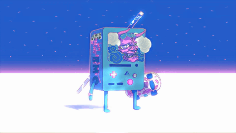

    

  

  

<body>

<!-- ================= PROFILE CARDS ================= -->

<!-- 

  
  &nbsp;&nbsp;&nbsp;
  

 -->

<!-- ================================================ -->
<!-- <h3 align="center">  Developer From India</h3>   -->

<!-- <h3 align="left">
  
</h3> -->
 &nbsp;&nbsp;

<!-- <h3 align="left">Connect with me:</h3>

  
  
  
  

 -->

# Karan
 

  

# 💫 About Me:

I'm Karan. I'm passionate about technology, AI, and building things. I like experimenting with new tools, learning by doing, and constantly exploring. Outside of coding, I'm into anime (nerd alert), meeting new people, and working on interesting stuff.  

## Tech Stack:
<b>Languages:</b> TypeScript, JavaScript, Python 
<b>Frontend:</b> React, Next.js, Tailwind CSS, Framer Motion 
<b>Backend:</b> Node.js, REST APIs, WebSockets 
<b>AI & GenAI:</b> LLMs, RAG, AI Agents, LangChain, Prompt Engineering, AI-assisted Development 
<b>DevOps & Tools:</b> Git, GitHub, Docker, Linux, WSL, CI/CD, Cloud Deployment 
<b>Currently Exploring:</b> AI Engineering, Machine Learning, Backend Development, Cloud & DevOps, Scalable Applications

# Techie Stuff

<table align="center">
  <tr>
    <td align="center" width="96">
      
       Python
    </td>
    <td align="center" width="96">
        
       JavaScript
    </td>
    <td align="center" width="96">
        
       Webpack
    </td>
    <td align="center" width="96">
        
       MySQL
    </td>
    <td align="center" width="96">
        
       TypeScript
    </td>
    <td align="center" width="96">
        
       Google Cloud Platform
    </td>
            <td align="center" width="96">
        
       C
    </td>
  </tr>
  <tr>
  <td align="center" width="96">
        
       Django
    <td align="center" width="96">
        
       Github
    </td>
    <td align="center" width="96"> 
        
       Git
    </td>
    <td align="center"  width="96">
        
       HTML5
    </td>
    <td align="center" width="96">
        
       CSS
    </td>
    <td align="center"  width="96">
        
       Windows
    </td>
                  <td align="center" width="96">
        
       Linux
    </td>
  </tr>
 <tr>
      <td align="center" width="96">
        
       MongoDB
    </td>
            <td align="center" width="96">
        
       VsCode
    </td>
              <td align="center" width="96">
        
       WordPress
    </td>
              <td align="center" width="96">
        
       Unity
    </td>
              <td align="center" width="96">
        
       Postman
    </td>
              <td align="center" width="96">
        
       AR/VR
    </td>
      <td align="center" width="96">
        
       Gitlab
    </td>
 </tr>
</table>
  

---

# GitHub Stats:

---

### ✍️ Random Dev Quote

---

  

